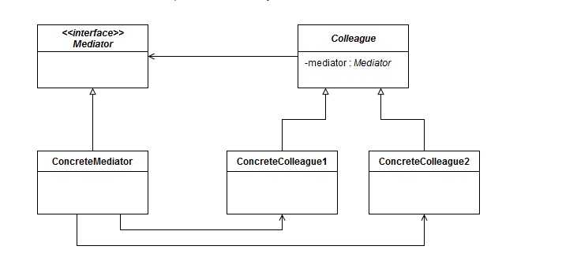

https://dzone.com/articles/design-patterns-mediator

>The Mediator defines the interface for communication between Colleague objects. The ConcreteMediator implements the Mediator interface and coordinates communication between Colleague objects. It is aware of all the Colleagues and their purpose with regards to inter communication.The ConcreteColleague communicates with other colleagues through the mediator.

