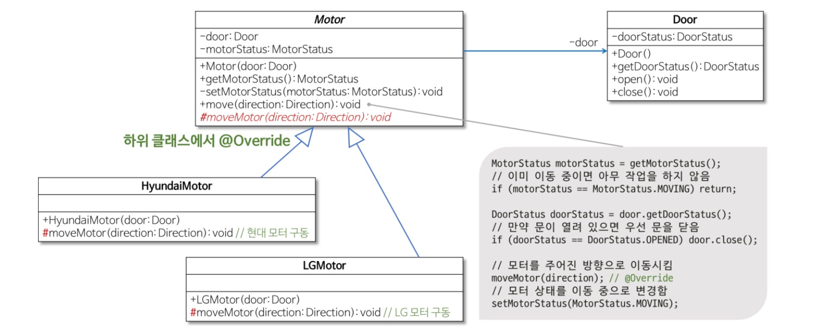

# 템플릿 메소드 패턴
객체의 연산에는 알고리즘의 뼈대만을 정의하고 각 단계에서 수행할 구체적 처리는 서브클래스 쪽으로 미룹니다. 알고리즘의 구조 자체는 그대로 놔둔 채 알고리즘 각 단계 처리를 서브클래스에서 재정의할 수 있게 합니다.

[참고]
 https://gmlwjd9405.github.io/2018/07/13/template-method-pattern.html
 GOF의 디자인 패턴